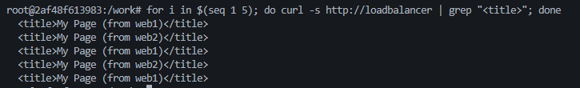
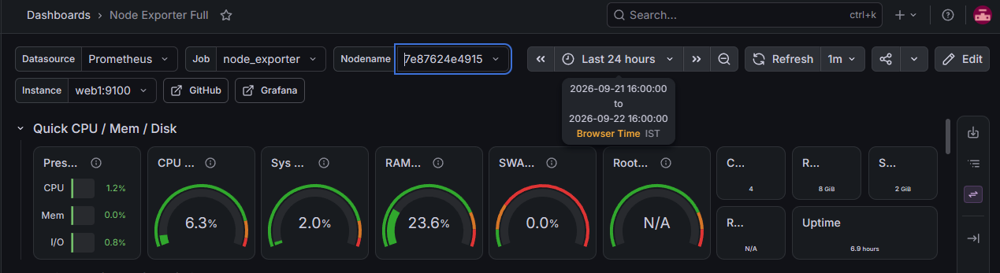
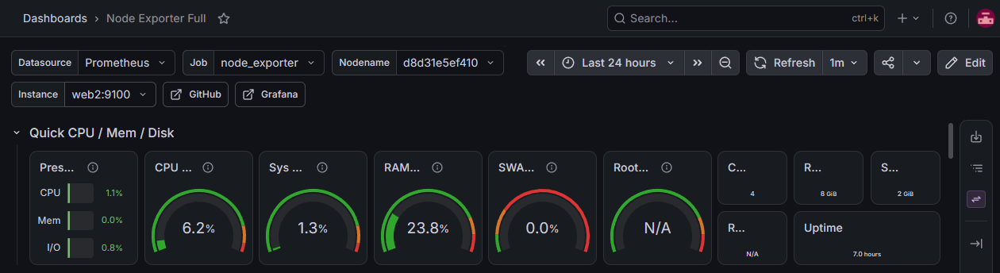
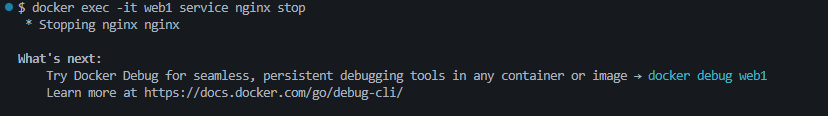
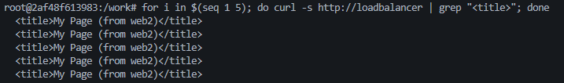
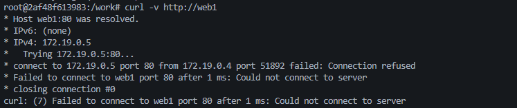
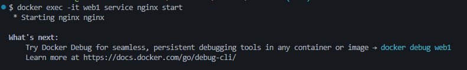
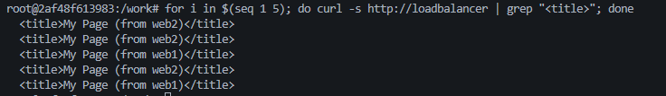
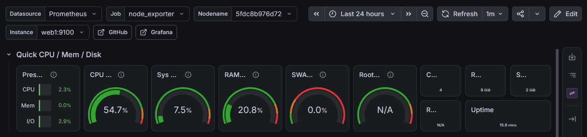

# Incident Runbook: Web Tier Failure & Recovery (Demo)

A deliberate kill-and-recover exercise demonstrating the load balancer's automatic failover behavior and the boundary of what host-level observability (node_exporter) does and doesn't catch.

## Scenario

nginx is stopped on `web1` while it's actively serving traffic behind the `loadbalancer` host, simulating an application-level service failure (as opposed to a host/container failure). The goal: confirm the load balancer routes around the failed upstream automatically, and observe what the monitoring stack does and doesn't detect.

## Baseline — before

Both web hosts healthy and receiving traffic:

```
$ for i in $(seq 1 5); do curl -s http://loadbalancer | grep "<title>"; done
<title>My Page (from web1)</title>
<title>My Page (from web2)</title>
<title>My Page (from web1)</title>
<title>My Page (from web2)</title>
<title>My Page (from web1)</title>
```


Grafana confirms both hosts reporting normal CPU/memory/uptime:




## Fault injection

```
$ docker exec -it web1 service nginx stop
 * Stopping nginx nginx
```


## During the outage

The load balancer's `least_conn` routing stops sending traffic to web1 — every request now lands on web2:

```
$ for i in $(seq 1 5); do curl -s http://loadbalancer | grep "<title>"; done
<title>My Page (from web2)</title>
<title>My Page (from web2)</title>
<title>My Page (from web2)</title>
<title>My Page (from web2)</title>
<title>My Page (from web2)</title>
```


Direct confirmation that web1 itself is refusing connections on port 80:

```
$ curl -v http://web1
*   Trying 172.19.0.5:80...
* connect to 172.19.0.5 port 80 from 172.19.0.4 port 51892 failed: Connection refused
curl: (7) Failed to connect to web1 port 80 after 1 ms: Could not connect to server
```


**What Grafana does *not* show:** node_exporter is a separate process from nginx, so stopping nginx has no effect on node_exporter's own metrics — web1's host-level panel (CPU, memory, uptime, the `up` indicator) reads as healthy throughout the outage. This is expected, not a monitoring gap in the sense of something broken — it's the actual boundary of what host-level metrics can see. **A service-specific exporter (e.g. for nginx) would be required to detect this failure from Prometheus/Grafana directly** — currently the only signal for this class of failure is the load-balancer/application layer, not the metrics layer. This is documented as a deferred improvement in the `monitoring` role README.

## Recovery

```
$ docker exec -it web1 service nginx start
 * Starting nginx nginx
```


Traffic resumes across both hosts:

```
$ for i in $(seq 1 5); do curl -s http://loadbalancer | grep "<title>"; done
<title>My Page (from web2)</title>
<title>My Page (from web2)</title>
<title>My Page (from web1)</title>
<title>My Page (from web2)</title>
<title>My Page (from web1)</title>
```




*(Note: the post-recovery dashboard capture shows a different container hostname/uptime than the baseline — the container was rebuilt between these two captures as part of separate clean-rebuild testing, not as a side effect of the nginx stop/start. The panel itself confirms the host is healthy post-recovery, which is the relevant point here.)*

## Findings

1. **Load balancer failover works correctly and requires no manual intervention** — `least_conn` routing stopped sending traffic to the failed upstream within the demo's request window, with no dropped requests observed from the client side (every request during the outage still got a valid response, just always from web2).
2. **Host-level metrics (node_exporter) do not detect application/service-level failures.** This is a real, honest limitation of the current setup, not a bug — node_exporter reports on the OS, not on individual services running on it. Catching this class of failure directly in Prometheus/Grafana would require a dedicated nginx exporter (or similar), which is documented as a deferred next step rather than implemented here.
3. **Recovery is immediate and automatic** on the load-balancing side — no configuration changes or restarts were needed on the `loadbalancer` host itself; it simply resumed routing to web1 once nginx there was healthy again.


